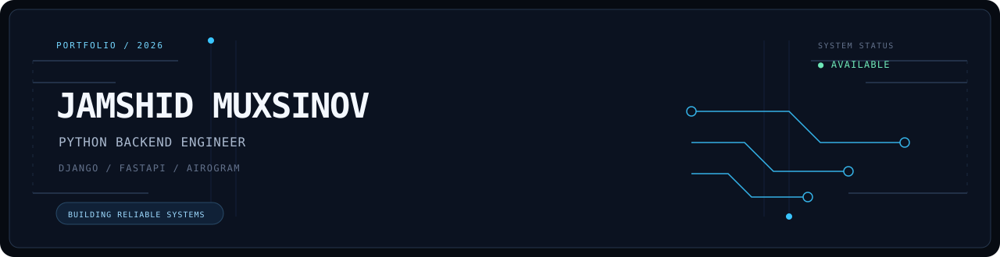
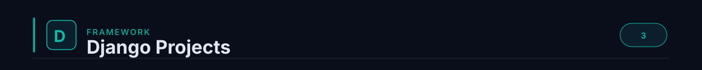
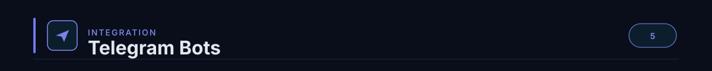

  

<table>
  <tr>
    <td width="56%" valign="top">
      <h3>About Me</h3>
      

        Я — <b>Jamshid Muxsinov</b>, Python backend-инженер. Проектирую надёжные веб-сервисы, автоматизацию и продукты, где важны чистая доменная логика, real-time сценарии и управляемая инфраструктура.
      

      

        От логистических кабинетов и document-collaboration до AI-генерации и Telegram-ботов — превращаю сложные процессы в понятные системы.
      

      <code>FOCUS → BACKEND ARCHITECTURE · ASYNC FLOWS · PRODUCT DELIVERY</code>
    </td>
    <td width="44%" valign="top">
      <h3>Tech Stack</h3>
      

        
        
      

      

        
        
      

      

        
        
        
      

    </td>
  </tr>
</table>

  
  

<table>
  <tr>
    <td width="50%" valign="top">
      <h3><b>Burgut Logistics</b></h3>
      
Полноценная система управления логистикой: публичная витрина, внутренний кабинет и трекинг грузов.

      
   

      <ul>
        <li>Расчёт тарифов для avia, auto, rail и sea</li>
        <li>Роли, приглашения, Excel-экспорт и вебхуки</li>
        <li>Уведомления и отслеживание через Telegram</li>
      </ul>
    </td>
    <td width="50%" valign="top">
      <h3><b>DocWeave</b></h3>
      
Local-first платформа для Markdown-документов с безопасным совместным доступом и живой синхронизацией черновиков.

      
   

      <ul>
        <li>Роли owner / editor / viewer и snapshots версий</li>
        <li>WebSocket-комнаты, presence и typing events</li>
        <li>Docker Compose для воспроизводимого окружения</li>
      </ul>
    </td>
  </tr>
</table>

<table>
  <tr>
    <td width="50%" valign="top">
      <h3><b>AI Photo Studio</b></h3>
      
AI-сервис для генерации маркетинговых фотографий одежды: от постановки задачи до выдачи готовой галереи.

      
   

      <ul>
        <li>Интеграции HuggingFace FLUX и Google Gemini</li>
        <li>JWT, история генераций и S3-совместимое хранилище</li>
        <li>WebSocket-статусы для real-time интерфейса</li>
      </ul>
    </td>
    <td width="50%" valign="top">
      <h3><b>AutoWash Pass</b></h3>
      
Backend для автомоек и абонементов, объединяющий клиентское Android-приложение и терминалы на точках обслуживания.

      
  

      <ul>
        <li>API для абонементов, терминалов и сессий мойки</li>
        <li>Alembic-миграции и CORS-ready сервисный слой</li>
        <li>Две нативные Android-роли: client и terminal</li>
      </ul>
    </td>
  </tr>
</table>

<table>
  <tr>
    <td width="50%" valign="top">
      <h3><b>Logistics Tracking Bot</b></h3>
      
Интегрированный Telegram-канал для логистической системы: уведомления, статусы и быстрый доступ к трекингу.

      
  

      <ul>
        <li>Бот встроен в операционные сценарии продукта</li>
        <li>Автоматические статусы и сообщения клиентам</li>
        <li>Единая логика с Django-приложением</li>
      </ul>
    </td>
    <td width="50%" valign="top">
      <h3><b>Telegram Video Downloader</b></h3>
      
Практичный бот, который принимает ссылку, скачивает видео через yt-dlp и возвращает файл в Telegram.

      
 

      <ul>
        <li>Маршрутизация команд и входящих ссылок</li>
        <li>yt-dlp, ffmpeg и настраиваемый proxy</li>
        <li>Контроль лимита Bot API и понятные ошибки</li>
      </ul>
    </td>
  </tr>
</table>

 

<table>
  <tr>
    <td width="50%" align="center">
       
      <b>TELEGRAM</b> · @jamshid_muxsinov
    </td>
    <td width="50%" align="center">
       
      <b>EMAIL</b> · jamshid-muxsinov@users.noreply.github.com
    </td>
  </tr>
</table>

DESIGNED AS A DARK-TECH SYSTEMS LOG · OPEN TO BACKEND &amp; AUTOMATION WORK

